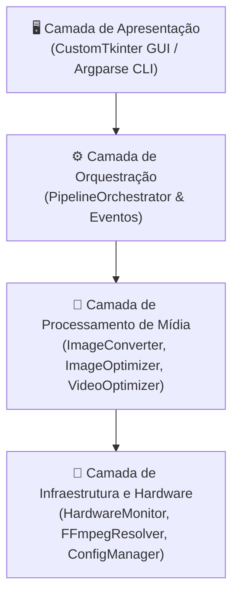

# Documento de Arquitetura e Design de Software (DESIGN.md)

Este documento detalha as decisões técnicas, modelo de concorrência, design de interface (UI/UX) e padrões de engenharia de mídia adotados no **Media Optimizer**.

---

## 🏗️ 1. Arquitetura em Camadas

O sistema é construído sobre quatro camadas desacopladas:

- **Camada de Apresentação (`gui.py`, `cli.py`):** Responsável exclusivamente pela interação com o usuário, validação inicial de parâmetros e exibição de métricas. O loop da interface nunca é bloqueado por operações pesadas.
- **Camada de Orquestração (`pipeline.py`):** Gerencia o ciclo de vida das tarefas (início, pausa cooperativa, retomada e cancelamento), consolidação de estatísticas e despacho seguro com auto-throttling.
- **Camada de Processamento (`converter.py`, `image_optimizer.py`, `video_optimizer.py`):** Realiza as transformações de imagens e vídeos de forma idempotente, atômica e paralela.
- **Camada de Infraestrutura (`hardware.py`, `ffmpeg_tools.py`, `config.py`):** Fornece serviços transversais como resolução de binários embutidos, telemetria de CPU/RAM/GPU, rebaixamento de prioridade e persistência em JSON.

---

## 🎨 2. Design System & UI/UX

A interface é orientada pelo **CustomTkinter**, trazendo visual limpo, moderno e com ergonomia pensada para longas sessões de processamento.

### Paleta de Cores e Temas
- **Modo Escuro (Dark - Padrão):**
  - Fundo da Janela: `#1a1a1a` / `#242424`
  - Painéis e Cartões: `#2b2b2b`
  - Texto Primário: `#f5f6fa` (alto contraste)
  - Cores Semânticas:
    - Sucesso / Iniciar: `#2ecc71` (Verde Esmeralda)
    - Pausa / Alerta: `#f39c12` (Âmbar)
    - Cancelar / Perigo: `#e74c3c` (Coral)
    - Primária / Acento: `#3498db` (Azul Oceano)
- **Modo Claro (Light) & Sistema:** Alternância suave com adaptação dinâmica ao tema do Windows/macOS/Linux.

### Princípios Ergonômicos
1. **Feedback Visual Imediato:** Qualquer ação (como iniciar, pausar ou selecionar pasta) atualiza instantaneamente o estado visual dos botões e barras de progresso.
2. **Telemetria Sempre Visível:** A barra superior fixa informa o estado da máquina (CPU, RAM, GPU, Temperatura) permitindo ao usuário saber se o computador está saudável ou sob sobrecarga.
3. **Console em Tempo Real com Rolagem Automática:** Mensagens claras informam exatamente qual arquivo está sendo convertido no momento.

---

## ⚡ 3. Modelo de Concorrência e Auto-Throttling

### Algoritmo Anti-Crash de Memória
Para evitar que processamentos em lote com centenas de arquivos HEIC de 48MP saturem a memória RAM e causem o fechamento abrupto do sistema operacional (*OOM Kill*):

1. O `HardwareMonitor` consulta periodicamente a taxa de ocupação da memória virtual (`psutil.virtual_memory().percent`).
2. Se o uso de RAM ultrapassar o limiar de segurança configurado (padrão: **88%**), a flag `is_throttling` torna-se verdadeira.
3. O `PipelineOrchestrator` injeta um atraso (*backoff sleep*) de 500ms entre as submissões de novas tarefas aos executores em lote até que o consumo caia para a faixa segura.

### Prioridade de Processo no Sistema Operacional
- No Windows: o processo FFmpeg e as threads de conversão têm sua classe de prioridade reduzida para `BELOW_NORMAL_PRIORITY_CLASS`.
- No Unix/Linux/macOS: aplicação de `nice(10)`.
- **Efeito prático:** O usuário pode continuar navegando na web, assistindo a vídeos ou trabalhando normalmente enquanto o Media Optimizer processa milhares de fotos em segundo plano.

---

## 🎞️ 4. Especificações de Engenharia de Mídia

### 1. Processamento de Imagens
- **Decodificação Universal:** Mapeamento automático de HEIC/HEIF via `pillow-heif` e arquivos RAW de câmeras via `rawpy`.
- **Orientação EXIF:** Correção de rotação baseada no tag EXIF 0x0112 via `ImageOps.exif_transpose`.
- **Fundo de Transparência:** Imagens PNG/WEBP com canal alfa (transparência) são mescladas suavemente sobre fundo branco puro (`(255, 255, 255)`) antes de converter para JPEG.
- **Redimensionamento LANCZOS:** Utiliza interpolação Lanczos de 8 lóbulos para preservação de nitidez ao reduzir fotos para no máximo 1350px no lado maior. Fotos menores que 1350px mantêm a resolução original intacta (regra de ouro *No-Upscale*).

### 2. Processamento de Vídeos
- **Resolução Máxima:** Limite de 1920px no lado maior mantendo proporções e arredondamento obrigatório para dimensões pares (requisito de codificadores YUV420p).
- **Capping Inteligente de Taxa de Quadros (FPS):**
  $$\text{target\_fps} = \begin{cases} 30, & \text{se } \text{fps\_orig} > 30 \\ \text{fps\_orig}, & \text{se } \text{fps\_orig} \le 30 \end{cases}$$
- **Otimização de Streaming:** Aplicação do parâmetro `-movflags +faststart` para mover o átomo `moov` para o início do arquivo de vídeo, viabilizando reprodução imediata na web sem carregar todo o arquivo.
- **Escrita Atômica:** Nenhum arquivo final é gravado diretamente no destino. O arquivo é gerado como `.tmp.mov` e renomeado somente se o FFmpeg retornar exit code 0.
