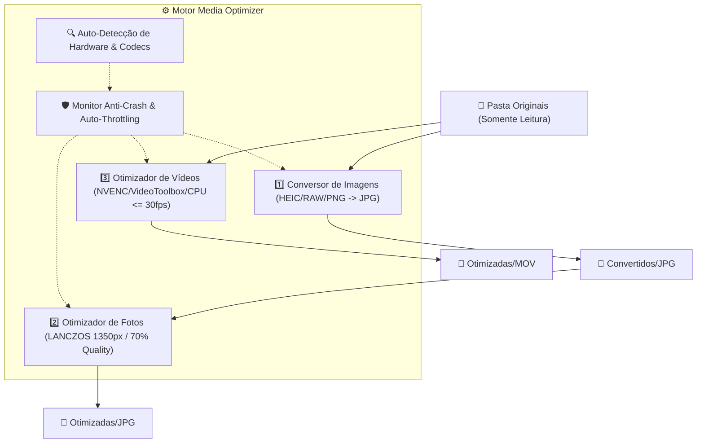

# 📸 Media Optimizer

<div align="center">

[](https://github.com/murphases/media-optimizer/actions/workflows/ci.yml)
[](https://github.com/murphases/media-optimizer)
[](https://polyformproject.org/licenses/noncommercial/1.0.0/)
[](https://github.com/murphases/media-optimizer/releases)
[](https://www.python.org/)

**Aplicativo desktop profissional e multiplataforma para conversão, redimensionamento e otimização de grandes acervos de fotos e vídeos.**  
*Especialmente otimizado para exportações do Google Photos Takeout, bibliotecas de câmeras Sony/Canon/Nikon e arquivos móveis (HEIC, RAW, AVIF).*

[Funcionalidades](#-funcionalidades-principais) •
[Instalação](#-instalação-e-download) •
[Como Usar](#-como-usar) •
[Arquitetura](#-arquitetura-e-segurança) •
[Documentação Técnica](#-documentação-técnica) •
[Licença](#-licença)

</div>

---

## 🌟 Funcionalidades Principais

- 🛡️ **Segurança Absoluta dos Arquivos Originais:** A pasta de origem é estritamente **somente leitura**. Nenhum arquivo original é modificado, movido ou apagado.
- 📦 **Zero Dependências para o Usuário Final:** O aplicativo já vem acompanhado de binários estáticos do **FFmpeg** e **FFprobe**. O usuário final não precisa instalar nada manualmente.
- ⚡ **Aceleração Universal por Hardware & CPU Fallback:**
  - **Processadores (CPU):** Suporte total a arquiteturas **x86**, **x64** (Intel Core, Xeon, AMD Ryzen, Threadripper, EPYC) e **ARM64** (Apple Silicon M-Series, Snapdragon X Elite) com multithreading dinâmico balanceado.
  - **NVIDIA:** Séries **RTX** e **GTX** via `h264_nvenc`, com suporte inteligente à série **GT** (detecção de placas sem bloco NVENC em silício e fallback automático e transparente para CPU sem travar a fila).
  - **AMD:** Séries **Radeon** e **RX** via `h264_amf` (Windows) e `h264_vaapi` (Linux).
  - **Intel:** Linha dedicada **Intel Arc** (A380, A580, A750, A770, B580) e integradas **Iris Xe / UHD Graphics** via `h264_qsv` (Quick Sync Video).
  - **Apple Silicon:** M1, M2, M3, M4 (Pro/Max/Ultra) via `h264_videotoolbox`.
  - **Fallback Universal:** Codificação multithread ultraestável via `libx264` caso nenhuma GPU compatível esteja presente.
- 🎛️ **Painel de Telemetria de Hardware (Anti-Crash & Auto-Throttling):** Monitora uso de CPU, memória RAM, temperatura e VRAM da GPU em tempo real. Se o consumo de memória ultrapassar o limite seguro (padrão: 88%), o motor desacelera o despacho para prevenir travamentos (*Out Of Memory*).
- 📷 **Conversão Ampla de Formatos de Imagem:** Converte HEIC, HEIF, Sony RAW (.ARW), Canon (.CR2), Nikon (.NEF), DNG, AVIF, WEBP, PNG, BMP, TIFF para JPG/WebP com preservação total de metadados EXIF e orientação.
- 🪄 **Redimensionamento Inteligente (LANCZOS):** Limita o lado maior para 1350px (fotos) e 1920px (vídeos), sem efetuar *upscale* em fotos ou vídeos menores.
- ⏱️ **Ajuste Inteligente de FPS em Vídeos:** Se o vídeo tiver mais de 30 fps (ex: 60 fps, 120 fps de celulares), reduz para 30 fps para economia massiva de espaço; se tiver $\le$ 30 fps (ex: 24 fps cinematográfico), mantém a taxa original.
- 💾 **Escrita Atômica & Capacidade de Retomada (Resume):** Cada arquivo é gerado inicialmente como `.tmp` e só é promovido a definitivo após conclusão e validação. Se o processo for interrompido, ao reiniciar ele pula automaticamente os arquivos já finalizados.
- 🎨 **Interface Gráfica Moderna (CustomTkinter):** Suporte nativo a temas Escuro (Dark), Claro (Light) e Sistema, sliders interativos, console integrado com logs em tempo real e modo Simulação (*Dry-Run*).

---

## 💻 Instalação e Download

Baixe a versão pronta para seu sistema operacional na aba [Releases](https://github.com/murphases/media-optimizer/releases):

### 🪟 Windows
- **Executável Portátil:** Baixe `MediaOptimizer-Portable.zip`, descompacte e dê duplo clique em `MediaOptimizer.exe`. Não requer instalação.
- **Instalador Oficial:** Baixe e execute `MediaOptimizer-Setup-v1.0.0.exe` para instalar no menu Iniciar com atalho na Área de Trabalho.

### 🐧 Linux
- **AppImage:**
  ```bash
  chmod +x MediaOptimizer-x86_64.AppImage
  ./MediaOptimizer-x86_64.AppImage
  ```
- **Flatpak:**
  ```bash
  flatpak install org.mediaoptimizer.MediaOptimizer.flatpak
  flatpak run org.mediaoptimizer.MediaOptimizer
  ```

### 🍏 macOS (Apple Silicon e Intel)
- Baixe `MediaOptimizer-macOS.dmg`.
- Abra a imagem de disco e arraste o aplicativo **Media Optimizer** para a pasta `Applications`.

---

## 🚀 Como Usar

### Modo Gráfico (GUI)
1. Inicie o aplicativo.
2. Na aba **🚀 Pipeline Completo**, selecione a **Pasta de Origem** (por exemplo, a pasta descompactada do Google Takeout).
3. Opcionalmente, escolha as pastas de destino para fotos e vídeos otimizados.
4. Clique em **▶️ Iniciar Pipeline Completo**.
5. Acompanhe a telemetria do seu hardware e a barra de progresso em tempo real. Você pode **Pausar**, **Retomar** ou **Cancelar** a qualquer momento.

### Modo Linha de Comando (CLI)
Para servidores, automações ou usuários avançados:
```bash
# Executar pipeline completo
python main.py --input "/caminho/originais" --output "/caminho/saida"

# Apenas conversão de imagens para JPG
python main.py --input "/caminho/originais" --mode convert --workers 12

# Simulação sem gravar em disco (Dry-run)
python main.py --input "/caminho/originais" --dry-run

# Exibir telemetria de hardware detectada
python main.py --telemetry
```

---

## 🧱 Arquitetura e Segurança



---

## 📚 Documentação Técnica

Para detalhes aprofundados sobre arquitetura, visão de produto e desenvolvimento com agentes de IA, consulte:
- [PRODUCT.md](PRODUCT.md) — Visão do produto, personas, proposição de valor e roadmap.
- [DESIGN.md](DESIGN.md) — Arquitetura de software, UI/UX design system e modelo de concorrência.
- [AGENTS.md](AGENTS.md) — Diretrizes, estrutura do repositório e regras para agentes de IA autônomos.
- [CONTRIBUTING.md](CONTRIBUTING.md) — Regras de contribuição, padrões de código e checklist de PRs.

---

## 🧪 Qualidade & Testes

O projeto adota política de **100% de Cobertura de Testes Obrigatória** com gates bloqueantes no CI.

Para rodar os testes localmente:
```bash
pytest --cov=media_optimizer --cov-report=term-missing --cov-fail-under=100
```

---

## 📄 Licença

Este projeto é disponibilizado sob a **[PolyForm Noncommercial License 1.0.0](LICENSE)**.
Você é livre para usar, modificar, estudar e compartilhar este software para quaisquer **fins não-comerciais** (uso pessoal, familiar, acadêmico ou comunitário sem cobrança). Para qualquer uso comercial, é necessária autorização prévia por escrito.
